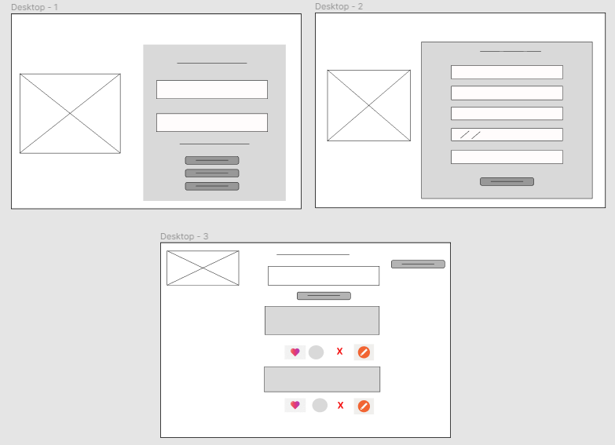
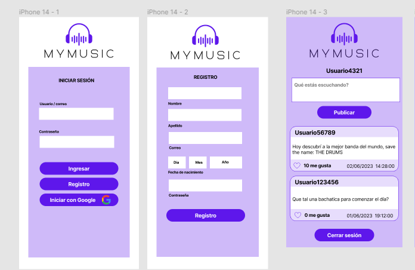
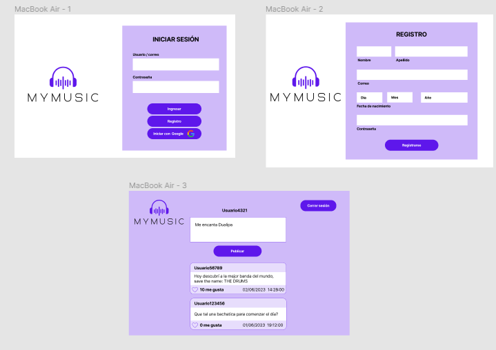

#  MYMUSIC

## Índice

* [1. Definición de producto](#1-Definición-de-producto)
* [2. Historias de usuario ](#2-Historias-de-usuario)
* [3. Prototipos](#3-Prototipos)
* [4. Implementación](#4-Implementación)
## 1. Definición de producto 

MyMusic es una red social para todos los amantes de la música, aquí podrán compartir sus pensamientos e indicar sus gustos musicales mediante publicaciones, las cuales se podrán editar o eliminar. Los usuarios pueden  interactuar con las publicaciones de otros con likes y visualizarán la cantidad de likes. Si son nuevos usuarios, se pueden registrar de dos formas, con un correo electrónico o bien, con una cuenta de Google.

## 2. Historias de usuario
  ### - Historia 1:

  Yo como usuario de esta red social :
  Deseo poder ingresar con un usuario/correo y una contraseña, de lo contrario poder registrar mis datos y crear una cuenta. 

  Para : acceder y participar en ella.
 
 Teniendo en cuenta estos requerimientos de la **primera HU** obtuvimos los siguientes **Criterios de aceptación** :

   * Tener dos campos, uno para ingresar el usuario/correo y otro para la contraseña.

   * Si no tengo una cuenta, poder crear una con correo o con mi cuenta de Google.
 
 Y la siguiente **Definición de terminado** :

* Estructurar el formulario de ingreso, añadiendo dos campos para los datos y un botón para consultarlos en la base de datos.
* Desarrollar las validaciones en JS para el ingreso, como que los campos no estén vacíos, que la contraseña o correo sean incorrectos, que uno de los campos esté vacío o que la cuenta ingresada no existe.
* Estructurar el formulario de registro, añadiendo los campos necesarios (...) para hacer el registro en la BD
* Desarrollar las validaciones en JS para el registro, como que se proporcione un correo con un formato válido, cantidad y tipo de caracteres para la contraseña, que la cuenta ya esté registrada.
* Desarrollar las pruebas unitarias para todas las validaciones especificadas anteriormente. 
* Utilizar localStorage(), para almacenar el usuario y contraseña para la persistencia de datos.
* Desarrollar el modelo entidad-relación de la BD.
* Mostrar el nombre del usuario que ah iniciado sesion.

 ### -Historia 2:

  Yo como usuario :
  Quiero tener un cuadro de texto y un botón.
  Para: crear una publicación y verla en mi muro.

  Teniendo en cuenta estos requerimientos de la **segunda HU** obtuvimos los siguientes **Criterios de aceptación** :

* Tener un campo de texto para escribir y poder publicarlo.
* Ver la publicación creada en el muro.

Y la siguiente **Definición de terminado** :

* Mostrar un campo de texto con input y un botón que envie la información a la base de datos
* Desarrollar la validación en JS para que el input no esté vacío
* Hacer la función en JS para mostrar las publicaciones en el muro cada vez que le damos clic al botón de publicar.

### -Historia 3:

  Yo como usuario:
  Quiero tener una opción de edición.

  Para: editar la publicación que desee.

  Teniendo en cuenta estos requerimientos de la **tercera HU** obtuvimos los siguientes **Criterios de aceptación** :

* Tener una opción para poder editar la publicación que el usuario creó.
* Poder guardar los cambios.

Y la siguiente **Definición de terminado** :

* Agregar un menú que muestre las opciones de interacción con la publicación, añadiendo el de editarla.
* Validación para que el campo de texto no quede vacío para que se modifique
* Agregar botón que envíe el nuevo texto a la BD y lo modifique en la publicación seleccionada (ID).
* Mostrar debajo de la publicación que ha sido modificada. 

### -Historia 4:
  
  Yo como usuario: 
  Quiero tener una opción de eliminar.

  Para: eliminar la publicación que seleccione.

Teniendo en cuenta estos requerimientos de la **cuarta HU** obtuvimos los siguientes **Criterios de aceptación** :

* Tener una opción para poder eliminar la publicación que el usuario creó.
* Que la publicación desaparezca del muro.

Y la siguiente **Definición de terminado** :

* Agregar al menú de interacción con la publicación la opción de eliminar.
* Validación para corroborar que el usuario está seguro de esa opción.
* Agregar acción que elimine de la BD esta publicación.

### -Historia 5:

  Yo como usuario: 
  Quiero ver una sección de likes.
  Para: poder indicar qué publicaciones me gustan y ver a quienes les gusta esa publicación. 

Teniendo en cuenta estos requerimientos de la **quinta HU** obtuvimos los siguientes **Criterios de aceptación** :

* Tener la opción de reaccionar con un corazón en t qodas las publicaciones las publicaciones que desee.
* Poder ver la cantidad de reacciones

Y la siguiente **Definición de terminado** :
* Agregar y darle usabilidad a un ícono de corazón con JS y que se coloque de otro color cuando sea seleccionado.
* Desarrollar la función para almacenar a los usuarios que les gusta la publicación y hacer el conteo.
* Además la validación de que sea una reacción por usuario en cada publicación, tomando en cuenta si ya encuentra o no en el arreglo que almacena las reacciones(ID de cada usuario).

## 3. Prototipos
 En nuestro proceso del diseño desarrollamos los siguientes prototipos :

**Prototipo de Baja Fidelidad  -  [FIGMA](https://www.figma.com/file/fsU5uQN5r7AuqjX4fJmu4J/Social-Network-team-library?type=design&node-id=0-1&mode=design&t=Wwt8Lat7zNsfCoTc-0)**

   
   

 **Prototipo de Alta Fidelidad - [FIGMA-MOBILE](https://www.figma.com/proto/fsU5uQN5r7AuqjX4fJmu4J/Social-Network-team-library?type=design&node-id=2111-58&t=Wwt8Lat7zNsfCoTc-0&scaling=scale-down&page-id=2111%3A57&starting-point-node-id=2111%3A58) - [FIGMA-DESKTOP](https://www.figma.com/proto/fsU5uQN5r7AuqjX4fJmu4J/Social-Network-team-library?type=design&node-id=2308-4&t=Wwt8Lat7zNsfCoTc-0&scaling=scale-down&page-id=2157%3A25&starting-point-node-id=2308%3A4)**  

## 4. Implementación
Este proyecto fue desplegado adecuamente y se puede ver el resultado final aqui : [MYMUSIC](https://social-network-4c6aa.web.app).

Fue desarrollado con las siguientes herramientas :
* **Firebase** - Donde fue creada la conexión con nuestra web mediante sus servicios de:
   * *Authentication:* Se implementó para que los usuarios puedan acceder a la web mediante correo electrónico y contraseña , o bien mediante una cuenta de google.
   * *Firestore:* Se implementó para tener una base de datos en la cual se pueda organizar la información de nuestra red social como son los usuarios y las publicaciones.
* **Javascrip:** Utilizado para el desarrollo de la lógica y manejo del DOM dinámicamente.
* **CSS:** Fue aplicado al diseño del sitio web, permitiéndonos organizar todos los elementos visuales presentes en él, como botones, secciones, áreas de texto, y demás.
 Siguiendo los fundamentos del  *responsive design* , que se ajusta a diferentes dispositivos (Desktop y mobile) y tamaños de pantalla.

